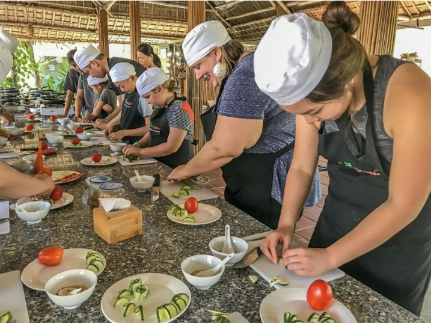

+++
date = "2023-07-10"
title = "CAM THANH COCONUT VILLAGE COOKING CLASS & BASKET BOAT RIDE"
+++

<p style="text-align: center; color: blue; font-weight: bold">Price : 27$/1 person</p>
<!--more-->

Cam Thanh ia a little charming village at the edge of Hoian, which is covered by nipa palm tree. During the Vietnamese wars, this was the shelters for soldiers and local people. Nowaday, the village is not only famous for providing seafood, but also favourite spot for tourrists. 

You also have a chance to take a wooden boat to go along Thu Bon river, where you can see the daily life of fishermen, how to paddle the unique Vietnamese bamboo basket boat, explore the tranquil coconut – palm and hand on of experience cast net.

<p style="text-align: center; color: blue; font-weight: bold">ITINERARY</p>

<p style="color: orange; font-weight: bold">08:30</p> 

Local guide (chef) pick up at the hotel takes you to market by car. We will have chance to see and experience the noise as well as directly contact to sellers. In addition to this, we will show the ingredients for using in our lesson. 

<p style="color: orange; font-weight: bold">09:15</p> 

Transferred from the local market to Cam Thanh coconut village by Car, then you will have a chance to take a traditional boat – a bamboo basket boat, you will be attracted by the untouched beauty of the palm trees in the village.

<p style="color: orange; font-weight: bold">10:20</p> 

Enjoy welcome drink and take a rest at our restaurant, then join cooking class. Four dishs our chef will teach you how to cook some local food. After the lesson, enjoy what you have cooked. 

<p style="color: orange; font-weight: bold">13:00</p> 

Return to hotel. 

<p style="color: orange; font-weight: bold">Menu(s)</p> 

```
Salty Menu:
    - Fish in clay pot with steam rice.
    - Hoian spring rolls. 
    - Papaya salad. 
    - Hoian rice pancake. 
    - Morning glory with garlic. 
    - Clam
```

```
Vegetarian Menu:
    - Tofu in clay pot with steam rice. 
    - Hoian spring rolls. 
    - Papaya salad. 
    - Hoian Rice pancake. 
    - Morning glory with garlic.
    - Vegetable soup.
```

Return to hotel. 

<p style="color: orange; font-weight: bold">Included:</p>

- Hotel pick up & drop off, All transportation: Car, Boat
- Meal 
- All Entrance fee. 
- Experienced English speaking guides. 
- 1 mineral water per each guest. 

<p style="color: orange; font-weight: bold">Excludes:</p>

- Personal expenses and Services not mentioned above. 
- TIP & VAT 

