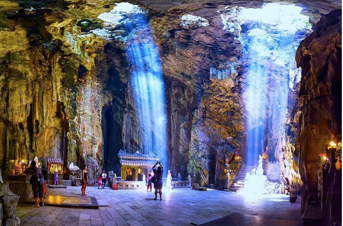
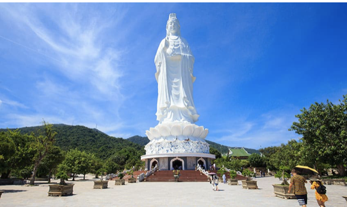

+++
date = "2023-07-10"
title = "MARBLE MOUNTAIN – HEAVEN CAVE & MONKEY MOUNTAIN"
+++

Price : 31$/1 person

<!--more-->

ITINERARY

08:00 - 08:15
 

- Pick you up at hotel
- Departure for Marble Mountains

09:00 - 11:00
 

From here by more than 230 marble steps up & down, you will discover the beauty of Marble Mountain with many marble caves, Buddist Pogodas, panorama view of local life & ocean from top of mountain and then visit the traditional mable carving village

11:00 - 12:30
 

- Leaving Marble Mountian for Monkey Mountain.
- During your time at Monkey Mountian you will learn about It’s history and will see the largest temple in Da Nang,stood in the hillside of Monkey mountain,Linh Ung Pagoda attracts millions of tourists annually.Walking around this religious complex visitors are able to see the panoramic view of Da Nang City.
- There will also be plenty of time for photos.

12:30 - 13:30
 

Leaving Monkey Mountain for lunch with vietnamese local lunch.

14:00
 

- Coming back Hoi An
- End tour

Included:

- A/C Car Transfer - Hotel pick up & drop off.
- Lunch
- All Entrance fee.
- Experienced English speaking guides.
- 1 mineral water per each guest.

Excludes:

- Personal expenses and Services not mentioned above. 
- TIP & VAT.

