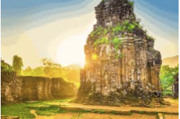

+++
date = "2023-07-10"
title = "MY SON CHAMPA – KINGDOM"
+++

Price : 31$/1 person (Small group tour)

<!--more-->

In Duy Phu village , Duy Xuyen district, Quang Nam province , at My Son valley, there is still a most important complex of Hindu temple - towers which is a symbol of ChamPa art and continuosly developed from the 4th century to the 13th century.

The ancient ChamPa people were raised to be “the masters of artin building brick “. So far the technique in building the ancient temple - towers of ChamPa people remains controversial . The brick were smoothed and laid closely and securely without mortar . My Son ‘s value is also refected in the art of lively and fine sculpture and carving on brick , store from the images of deties , priests , dances , plants, animals and sacrifices...

Because of its prominent value as an example of cultural exchange and integration of external cultures , especially the art and architecture of Hinduism with the native culture , combined with lively refection of the ChamPa Kingdom in south east culture history , in december 1999 , Unesco listed My Son a word cultural heritage.

ITINERARY

08:00
 

Our Tour guide & Driver pick you up at your hotel and depart to My Son Sanctuary - The World Cultural Heritage.

09:00
 

Arrive at My Son and we'll have 2 hours to discover the site by walking throughout the landscape, learning histories with our local English speaking guide, enjoying the Champa's traditional performances.

11:00
 

Go to a local house to learn how to make ricepaper, you will enjoy your own hand-making product later on!

11:30
 

Have lunch.

12:30
 

Take a boat trip to Hoi An with nice and cool breeze on boarding, beautiful river scenery on the biggest river in the Central of vietnam named as Thu Bon River. 

13:30
 

Arive Hoi An, drop off at your hotel.  Tour ends! 

Included:

- Transportation, Hotel Pick up & Drop off
- English speaking tour guide.
- Lunch
- Boat trip on Thu Bon river 
- A bottle of water .
- All Entrance

Excludes:

- Personal expenses and Services not mentioned above. 
- TIP & VAT.

